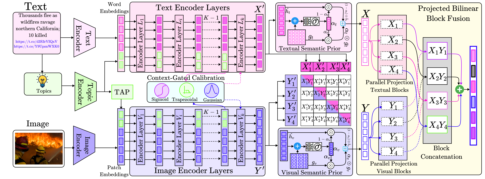

<div align="center">


# CAFuNet: Context-Aligned Fusion Network for Multimodal Crisis Informatics

**ACL 2026**

[]()
[]()
[]()
[]()

</div>

## Table of Contents

- [Abstract](#abstract)
- [Architecture](#architecture)
- [Datasets](#datasets)
- [Installation](#installation)
- [Project Structure](#project-structure)
- [Topic Induction](#topic-induction)
- [Training](#training)
- [Evaluation](#evaluation)
- [Results](#results)
- [Citation](#citation)

## Abstract

Multimodal social media data during crisis events presents significant challenges for classification due to noisy visual content, short or ambiguous text, and weak alignment between modalities. We propose **CAFuNet** (Context-Aligned Fusion Network), a multimodal classification architecture designed for humanitarian event analysis. CAFuNet introduces three components:

1. **Dual Topic-Conditioning Mechanism (TGP)** — injects corpus-induced topic representations into both visual and textual encoders to provide shared semantic conditioning.
2. **Context-Gated Calibration (CGC)** — modulates feature magnitudes based on their consistency with the shared context using parameterized fuzzy membership functions.
3. **Projected Bilinear Block Fusion (PBBF)** — captures low-rank multiplicative interactions between modalities.

Experiments on **CrisisMMD** and **TSEqD** benchmarks show that CAFuNet consistently improves macro-F1 over strong multimodal baselines, achieving gains of **+3.27** and **+2.61** points, respectively.

## Architecture

<p align="center">
  
</p>

CAFuNet processes multimodal inputs (text + image) through parallel encoder streams. The pipeline consists of:

| Stage | Component | Description |
|:------|:----------|:------------|
| **Topic Conditioning** | Topic-Guided Conditioning (TGC) | Prepends BERTopic-induced topic embeddings to both encoder inputs; a Topic Alignment Projector (TAP) maps text-derived topics into the visual space |
| **Calibration** | Context-Gated Calibration (CGC) | Fuzzy membership functions (Gaussian, Sigmoid, Trapezoidal) produce gating scores that multiplicatively recalibrate features based on contextual alignment |
| **Enrichment** | Hybrid Feature Enrichment | Gated blending of domain-aware features with frozen CLIP priors for improved generalization |
| **Fusion** | Projected Bilinear Block Fusion (PBBF) | B parallel low-rank bilinear interaction blocks capture disentangled cross-modal interactions |
| **Objective** | Holistic Loss | Weighted cross-entropy + auxiliary InfoNCE contrastive loss on pre-fusion unimodal representations |

## Datasets

We evaluate on two established crisis informatics benchmarks:

### CrisisMMD

The [CrisisMMD](https://crisisnlp.qcri.org/) dataset (Alam et al., 2018) contains image-text pairs from Twitter covering seven major natural disasters from 2017. We use the **humanitarian categorization** task with the official predefined splits.

### TSEqD

The Turkey-Syria Earthquake Dataset ([TSEqD](https://doi.org/10.1016/j.eswa.2024.125337); Dar et al., 2025) provides multimodal data from the 2023 earthquake, annotated with humanitarian labels. We construct a stratified **80:10:10** train/val/test split.

| Split | CrisisMMD | TSEqD |
|:------|----------:|------:|
| Train | 6,055 | 7,708 |
| Val | 989 | 964 |
| Test | 946 | 964 |

## Installation

### Prerequisites

- Linux (tested) / Windows
- Python 3.10+
- CUDA 12.6+ compatible GPU with at least 24 GB VRAM
- [Conda](https://docs.conda.io/en/latest/) (recommended)

### Setup

```bash
# Clone the repository
git clone https://github.com/<your-username>/cafunet-acl2026.git
cd cafunet-acl2026

# Create conda environment
conda create -n cafunet python=3.10 -y
conda activate cafunet

# Install PyTorch (adjust CUDA version as needed)
pip install torch torchvision --index-url https://download.pytorch.org/whl/cu126

# Install remaining dependencies
pip install transformers open-clip-torch timm clip sentence-transformers \
            bertopic umap-learn hdbscan scikit-fuzzy einops \
            pandas scikit-learn matplotlib plotly pydantic pyyaml \
            nltk tqdm pillow
```

### Data Preparation

1. **CrisisMMD**: Download the dataset from [CrisisNLP](https://crisisnlp.qcri.org/) and place the TSV splits and `CrisisMMD_v2.0/` image directory under:
   ```
   ../Multimodal-Disaster-Classification/multimodal-disaster-datasets/crisis-mmd/
   ```

2. **TSEqD**: Obtain the dataset following [Dar et al., 2025](https://doi.org/10.1016/j.eswa.2024.125337) and place the TSV file at:
   ```
   ./multimodal-disaster-datasets/tseqd/updated_TSEQD_datasetfile.tsv
   ```

The expected directory layout:

```
cafunet-acl2026/
├── multimodal-disaster-datasets/
│   └── tseqd/
│       └── updated_TSEQD_datasetfile.tsv
└── ...

../Multimodal-Disaster-Classification/
└── multimodal-disaster-datasets/
    └── crisis-mmd/
        ├── crisismmd_datasplit_agreed_label/   # TSV split files
        └── CrisisMMD_v2.0/                    # images
```

## Project Structure

```
cafunet-acl2026/
├── run.py                          # Main training entry point
├── test_run.py                     # Evaluation script (loads pretrained checkpoint)
├── explainability.py               # Qualitative analysis / explainability
├── config.yaml                     # All hyperparameters and settings
├── constants.py                    # Paths, label mappings, field names
├── enums.py                        # Enumerations
│
├── models/
│   ├── cirsis_mmd_vision_text_pipeline/
│   │   └── model.py                # CAFuNet main model
│   └── vision_text_pipeline_common/
│       ├── clip_embedding.py       # CLIP encoder wrapper
│       ├── text_vision_fuser/
│       │   └── model.py            # Vision & Text encoders with topic conditioning
│       ├── block_fusion.py         # Projected Bilinear Block Fusion (PBBF)
│       ├── fuzz_feature_extractor.py       # Fuzzy feature extraction
│       └── fuzzy_membership_network.py     # CGC membership functions
│
├── topic_modelling/
│   ├── crisis_mmd.py               # BERTopic induction for CrisisMMD
│   └── tseqd.py                    # BERTopic induction for TSEqD
│
├── data/
│   ├── dataloader_interface.py     # DataLoader construction
│   ├── dataset_interface.py        # Dataset base interface
│   └── datasets/
│       ├── crisis_mmd_dataset/
│       │   └── dataset.py          # CrisisMMD data loading & preprocessing
│       └── tseqd_dataset/
│           └── dataset.py          # TSEqD data loading & preprocessing
│
├── model_meta_components/
│   └── loss_functions/
│       ├── vision_text_pipeline_loss_function.py   # CE + contrastive loss
│       └── vtp_cross_entropy_loss.py
│
├── runner_builders/
│   ├── base.py                     # Runner factory
│   └── crisis_mmd_runners.py       # Runner configs (optimizer, scheduler, weights)
│
├── runner_interfaces/
│   ├── pytorch_runner_interface.py  # Train/val/test epoch logic
│   └── ...
│
├── utils/
│   ├── config_utils.py             # YAML config loader
│   ├── metric_utils.py             # Accuracy, Precision, Recall, F1
│   ├── data_utils.py               # DataLoader param helpers
│   └── gpu_utils.py                # Device selection
│
└── requirements.txt
```

## Topic Induction

CAFuNet uses **BERTopic** with `distilroberta-base-msmarco-v1` sentence embeddings to extract domain-specific topics from the training corpus. Topics are induced offline and loaded during training.

To run topic induction for CrisisMMD:

```bash
python -m topic_modelling.crisis_mmd
```

For TSEqD:

```bash
python -m topic_modelling.tseqd
```

The induced topic models are saved to `topic_modelling/crisis_mmd_topic_model/` and `topic_modelling/tseqd_topic_model/`, respectively. Set `train_bert_topic: true` in `config.yaml` to re-train the topic model during the main run, or `false` to load from disk.

## Training

All training configuration is managed through `config.yaml`. Key hyperparameters:

| Parameter | Default | Description |
|:----------|:--------|:------------|
| `seed` | 11 | Random seed |
| `num_epochs` | 100 | Maximum training epochs (early stopping applied) |
| `train_batch_size` | 32 | Training batch size |
| `embedding_dim` | 512 | Shared embedding dimensionality |
| `cl_loss_temperature` | 1.0 | Contrastive loss temperature (tau) |
| `max_len_text` | 128 | Maximum text token length |
| `use_lr_scheduler` | 1 | Enable StepLR scheduler |
| `apply_gradient_clipping` | 1 | Enable gradient clipping |
| `crisis_mmd_like_dataset_to_use` | `crisis_mmd_dataset` | Dataset selector (`crisis_mmd_dataset` or `tseqd_dataset`) |

**Optimizer:** AdamW (lr=5e-5, weight_decay=7e-5) with StepLR (step_size=5, gamma=0.8).

### Run training

```bash
# Single GPU
python run.py

# Distributed (multi-GPU) — set run_parallel: true in config.yaml
python run.py
```

To switch between datasets, update `crisis_mmd_like_dataset_to_use` in `config.yaml`:

```yaml
# For CrisisMMD
crisis_mmd_like_dataset_to_use: crisis_mmd_dataset

# For TSEqD
crisis_mmd_like_dataset_to_use: tseqd_dataset
```
## Evaluation

To evaluate a trained checkpoint on the test set:

```bash
python test_run.py
```

This loads the best checkpoint (saved during training based on test accuracy), runs a single test epoch, and writes metrics to `test_run_logs/`.


### Sensitivity to Topic Count (N_t)

Performance peaks at **N_t = 10** topics and remains stable across a moderate range, demonstrating robustness to this hyperparameter.

### Computational Efficiency

CAFuNet contains approximately **150M parameters** (comparable to standard multimodal encoders) with an inference latency of **~22 ms** per batch (batch size 32) on a single GPU — significantly faster than autoregressive VLMs (>200 ms).

## Citation

If you find this work useful, please cite our paper:

```bibtex
@inproceedings{cafunet2026,
    title = "Context-Aligned Topic Conditioning and Calibrated Fusion for Multimodal Crisis Informatics",
    booktitle = "Proceedings of the 64th Annual Meeting of the Association for Computational Linguistics (ACL 2026)",
    year = "2026",
}
```

## License

This project is licensed under the [MIT License](LICENSE).
